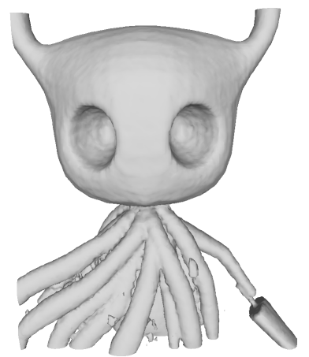

# SDF representation with an MLP

Simple network showing DeepSDF style representation of a single shape. Uses NeRF style positional encoding for easier overfitting to shape.

## Dependencies

This repository requires `numpy`, `pytorch`, `pytorch-lightning` and `PyMarchingCubes` (found [here](https://github.com/JustusThies/PyMarchingCubes)).

## Training

Train using the following command from root directory:
```bash
python trainer/train_implicit.py
```

## Expected Output



## File Structure

| Folder                    | Description                            |
|---------------------------|----------------------------------------|
| `data/hollow_knight.npz`    | Contains the raw data for training     |
| `dataset/point_sdf_pair.py` | Contains dataset class for training    |
| `model/implicit.py `        | Implicit network specification         |
| `trainer/train_implicit.py` | Training module                        |
| `outputs`                  | Mesh output dumped here while training |
| `runs`                      | Checkpoints saved here while training  |

## 3D Model Used
Hollow knight (https://sketchfab.com/3d-models/hollow-knight-86c4d4bfc46645169211130e3dd2c810) by EduVelazquez is licensed under Creative Commons Attribution (httpcreativecommons.orglicensesby4.0).